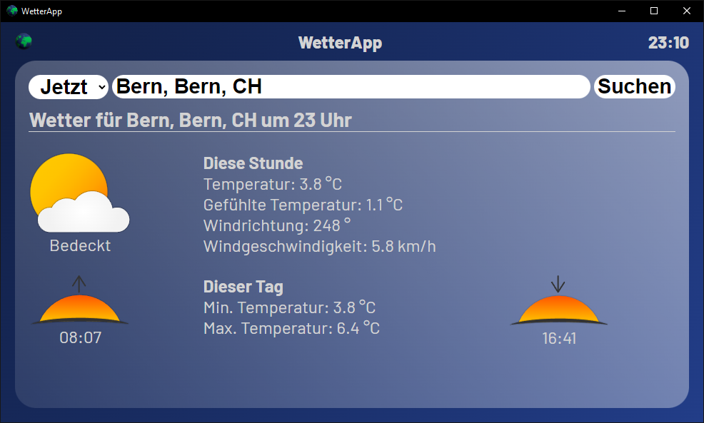

# WetterApp 1.3 (2022)

This program is written in Python. With the help of the Python 3 implementation [brython](https://brython.info/index.html), it runs web-based. It is cross-platform with [ElectronJS](https://www.electronjs.org/).

**Note:** This repository is archived. The program was developed when our knowledge was very limited, so please use it at your own risk.

## Authors
We, Oliver, David, Isha, and Tim D., developed this program in Module 122 at [gibb](https://gibb.ch/) in 2022.

## APIs
- [OpenWeather Geocoding API](https://openweathermap.org/api/geocoding-api)
- [OpenMeteo Weather API](https://open-meteo.com/en)
